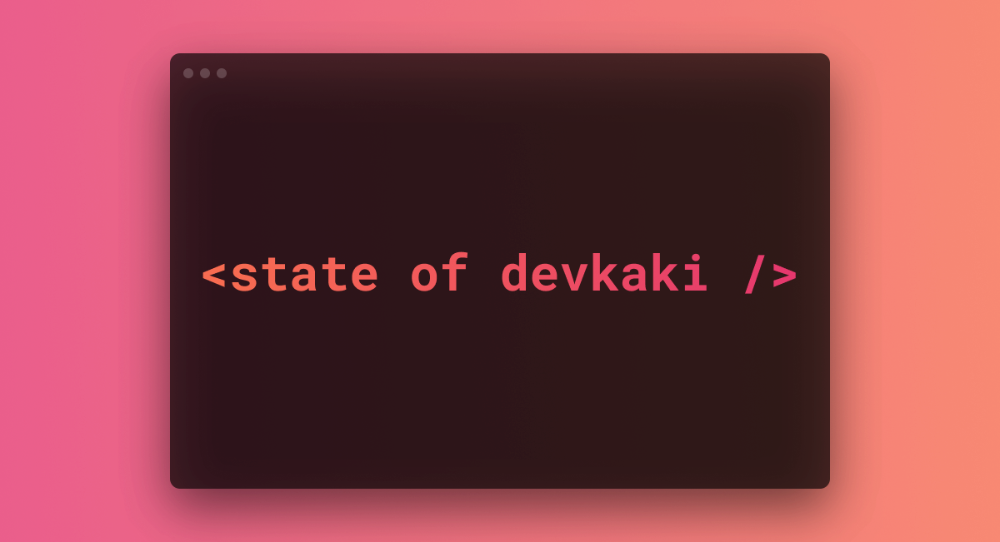

<div align="center">
  
</div>
  
## 💡 Overview

This is a data visualization project of the state of [DeveloperKaki](https://www.facebook.com/groups/developerkaki/), the largest online developer community in Malaysia, based on the data from the [Developer Salary Survey](https://www.facebook.com/groups/developerkaki/permalink/1475965772749331/).

## 🛠 Installation

**Clone repository**

```
git clone https://github.com/itschrislow/state-of-developer-kaki-2021.git
```

**Development mode**

```
yarn
yarn start
```

**Production mode**

```
yarn build
yarn global add serve
serve -s build
```

## 📄 Getting Started

### Data processing

On server restart, a [script](src/data/scripts.js) will be run to write chart data to be consumed by chart-related components. Chart data is formatted by the [helpers](src/data/helpers.js) file following the format specified in [nivo](https://nivo.rocks/)'s documentation (data vizualization library used).

See the main project structure below for more information.

### Main Project Structure

Important folders and files in the [`src`](src) directory

```bash
|- data
|   |- dataset.json                   # cleaned dataset
|   |- helpers.js                     # helper functions to format chart data based on nivo documentation
|   |- scripts.js                     # script to write formatted data into charts folder below on server restart
|   |- charts
|       |- [chart1].json
|       |- ...
|
|- components
|   |- charts                         # contains only chart components
|       |- [ChartComponentName].jsx
|       |- ...
|   |- [ComponentName].jsx            # all other components
|   |- ...
```

### Environment Variables

`REACT_APP_GA_ID` (optional) - Google Analytics ID
